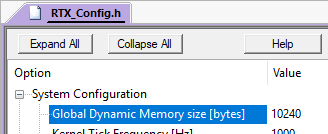
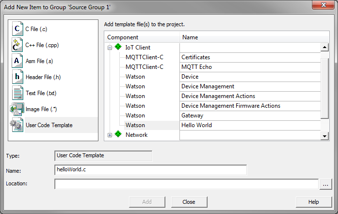

Getting started with IBM Watson IoT and MDK
===========================================

This tutorial explains how to use **MDK** and the **Watson_IoT_Device** pack to connect your application to the IBM Watson IoT Cloud.

Prerequisites
-------------
You require a development board with a device that is supported by [CMSIS-Drivers](http://arm-software.github.io/CMSIS_5/Driver/html/index.html). Lots of devices from STMicroelectronics and NXP do have these drivers available. Please consult the [device database](https://www.keil.com/dd2) for a list of devices and development boards.

When you have chosen your device and development board, use [Pack Installer](https://www.keil.com/support/man/docs/uv4/uv4_ca_packinstaller.htm) to download and install the following software packs:

* **MDK-Packs::Watson_IoT_Device**
* **MDK-Packs::Paho_MQTT** v1.0.0 or newer
* **MDK-Packs::IoT_Socket** v1.0.0 or newer
* **MDK-Packs::cJSON** v1.0.0 or newer
* **ARM::CMSIS** v5.0.1 or newer
* **ARM::mbedTLS** v1.5.0 or newer
* **Keil::MDK-Middleware** v7.7.0 or newer
* Device family pack for the selected device

**Note**:

* In order to be able to use the IBM Watson IoT Cloud Connector, you require a MDK-Professional license. &micro;Vision allows you to start a [seven day trial](http://www2.keil.com/mdk5/activation/) from within the tool.
* This tutorial assumes that you know how to work with &micro;Vision (creating projects, adding template code, configuring software components). If not, check out the [MDK Getting Started Guide](https://armkeil.blob.core.windows.net/product/gs_MDK5_4_en.pdf).
* In this tutorial, your MDK installation folder will be referenced as \<INSTALL_FOLDER>. Usually, it is C:\\Keil_v5.


In the IBM Watson IoT Platform dashboard
----------------------------------------

Follow IBM Watson IoT Platform instructions on page [Getting started tutorial](https://console.bluemix.net/docs/services/IoT/getting-started.html#getting-started-with-iotp) under **Step 1: Register your device**.

0. [Sign in](https://console.bluemix.net/login) to your [IBM Cloud account](https://console.bluemix.net/registration/).
1. In the IBM Cloud console, click **Launch** on the Watson IoT Platform service details page.
2. In the Overview dashboard, from the menu pane, select **Devices** and then click **Add Device**.
3. Create a device type for the device that you are adding.
4. Click **Next** to begin the process of adding your device with the selected device type.
5. Enter a device ID, for example `my_first_device`.
6. Click **Next** to complete the process.
7. Provide an authentication token, or accept an automatically generated token.
8. Verify the summary information is correct, and then click **Add** to add the connection. 
9. In the device information page, copy and save the following details:
 * Organization ID
 * Device Type
 * Device ID
 * Authentication Method
 * Authentication Token

You'll need Organization ID, Device Type, Device ID, and Authentication Token to configure your device to connect to Watson IoT Platform.


In &micro;Vision
----------------

Follow these steps to create a simple application that connects to the IBM Watson IoT Cloud.

### Create project and select software components
1. Create a new project. Select the device that you are using on your development board.
2. The  Manage Run-Time Environment window opens. Select the following software components:
    * **IoT Client:Watson**
    * **IoT Client:MQTTClient-C**
    * **IoT Utility:MQTTPacket**
    * **IoT Utility:Socket:MDK Network**
    * **Data Exchange:JSON:cJSON**
    * **CMSIS:RTOS2:Keil RTX5**
    * **CMSIS:CORE**
    * **Security:mbed TLS**
    * **Network:** make sure to select the variant **MDK-Pro**
    * **Network:Socket:BSD**
    * **Network:Socket:TCP**
    * **Network:Socket:UDP**
    * **Network:Service:DNS Client**
    * **Network:Interface:ETH**
    * **Network:CORE:IPv4 Release**
    * **Compiler:I/O:File**
    * **File System:CORE:LFN**
    * **File System:Drive:Memory Card** (or a different Drive depending on your system)
    * **CMSIS Driver:Flash:MCI (API)** (or a different driver depending on your File System Drive)
    * **CMSIS Driver:Ethernet/MAC/PHY (API)** (depending on your hardware)
    * **Device:Startup** (and any other Device dependent components)
    
    Optional (for `printf` debug output on the console):
    * **Compiler:I/O:STDOUT:ITM**

### Configure the software components
1.  Configure the Watson environment: **IoT Client::iotf_env.c**
    * Define `IOT_EMBDC_HOME` as the home folder on the File System Drive (default is none). The home folder is used for log files and the server certificate (when path is not specified).
    * Define `IOT_EMBDC_LOGGING` to enable logging (disabled by default). The log file "iotfclient.log" is then written to the File System Drive home folder.    
2.  Configure mbedTLS: **Security:mbedTLS_config.h**
    * In the Project window, double-click this file to open it. It contains generic settings for mbed TLS and its configuration requires a thorough understanding of SSL/TLS. We have prepared an example file that contains all required settings for IBM Watson IoT Cloud. The file available in `<INSTALL_FOLDER>/ARM/Pack/MDK-Packs/Watson_IoT_Device/_version_/config/mbedTLS_config.h`. Copy its contents and replace everything in the project's mbedTLS_config.h file.
3.  If you are using the software components described above, you do not need to configure other Network components. The default settings will work. If you do not have DHCP available in your network, please refer to the [MDK-Middleware documentation](http://www.keil.com/pack/doc/mw/Network/html/index.html) on how to set a static IP address.
4.  Configure RTX5: **CMSIS:RTX_Config.h**
    * If you are using the provided templates (see below), you need to set the **System - Global Dynamic Memory size** to at least 10240:<br>
    <br>
    This large amount of dynamic memory is not required for custom projects.
5.  Configure Heap: **startup_\<device>.s**
    * Configure at least 48 KB (0xC000) of heap memory.<br> 
    <br>
    This is required for the mbed TLS certificates.
6.  Configure device specific hardware:
    * Configure the CMSIS MCI driver, CMSIS Ethernet driver and other device specific components (clock system, I/O, ...) as required. Please consult your device's/board's documentation for more information.

### Add Template code
The **Watson_IoT_Device** pack includes code samples that can be used to test the connection to IBM Watson IoT Cloud. In the Project window, right-click "Source Group 1" and select "Add New Item to Group" - "User Code Template", to add user code templates.

1.  Hello World sample code:
    * Add **IoT Client:Watson:Hello World**<br>
    <br>
    * Update the following definitions as created in the IBM Watson IoT Console
      * `ORG_ID`: Enter the **Organization ID** here
      * `DEVICE_TYPE`: Enter the **Device Type** here
      * `DEVICE_ID`: Enter the **Device ID** here
      * `TOKEN`: Enter the **Authentication Token** here
      <br>
    Other templates (Device, Device Management, Device Management Actions, Device Management Firmware Actions and Gateway) do not use the above mentioned definitions but rather a configuration file "device.cfg" stored on a File System Drive. It should contain the following:<br>
    `org=$orgId`<br>
    `domain=$domain`<br>
    `type=$myDeviceType`<br>
    `id=$myDeviceId`<br>
    `auth-method=token`<br>
    `auth-token=$token`<br>
    `serverCertPath=$customServerCertificatePath`<br>
    `useClientCertificates=0 or 1`<br>
    `rootCACertPath=$rootCACertPath if useClientCertificates=1`<br>
    `clientCertPath=$clientCertPath if useClientCertificates=1`<br>
    `clientKeyPath=$clientKeyPath if useClientCertificates=1`<br>
    Note: RootCACert, ClientCert and ClientKey should also be stored on the File System Drive when `useClientCertificates=1`

2.  Add **CMSIS:RTOS2:Keil RTX5:main** and update:
    * Add an attribute for an increased stack size for the application thread. Sample requires a thread stack size of 8 KB:<br>
      `const osThreadAttr_t app_main_attr = { .stack_size = 8192U };`
    * Change application thread creation (include the attribute defined above):<br>
      `osThreadNew(app_main, NULL, &app_main_attr);`
    * Add an include for the File System and Network libraries (beginning of file):<br>
      `#include "rl_fs.h"`<br>
      `#include "rl_net.h"`
    * Add a prototype for the example's top level function:<br>
      `extern int helloWorld (void);`
    * Add File System and Network initialization in the `app_main` function:<br>
      `uint32_t addr;`<br><br>
      `finit("M0:");`<br>
      `fmount("M0:");`<br><br>
      `netInitialize();`<br>
      `do {`<br>
      &nbsp;&nbsp;`osDelay(500U);`<br>
      &nbsp;&nbsp;`netIF_GetOption(NET_IF_CLASS_ETH | 0, netIF_OptionIP4_Address, (uint8_t *)&addr, sizeof (addr));`<br>
      `} while (addr == 0U);`
    * Add a call to the example's top level function into the `app_main` function after above mentioned initialization (replace the `for` loop):<br>
      `helloWorld();`

### Provide Server Certificate
The Server Certificate should be stored on the File System Drive. A custom path can be specified as parameter `serverCertPath` in the `initialize` function or in the configuration file when using `initialize_configfile` function.
The file `IoTFoundation.pem` is taken from the home folder when no path is specified (NULL pointer or empty string). The server certificate for the IBM Cloud IoT domain "internetofthings.ibmcloud.com" is available here `<INSTALL_FOLDER>/ARM/Pack/MDK-Packs/Watson_IoT_Device/IoTFoundation.pem`.

    
### Optional: Configure debug
Code templates are prepared to output `printf` statements for debugging purposes. To show these effectively, you can use the software component **Compiler:I/O:STDOUT:ITM** to show the messages in the [Debug printf](http://www.keil.com/support/man/docs/uv4/uv4_db_dbg_serialwin.htm) window. To enable this output, do the following:

1.  Open the  Options for target dialog (**Alt+F7**).
2.  Go to the **Debug** tab. Select the debug adapter that is connected to your target and configure these **Settings**:
    * **Debug** tab: Set **Port** to **SW**.
    * **Trace** tab: Set the **Core Clock** to the system clock of your target, Select **Trace Enable** and set make sure that **ITM Stimulus Port 0** is enabled:<br>


### Run/debug the application
1.   Build the application (**F7**) and  download (**F8**) to target.
2.  Enter  debug (**CTRL+F5**) and  run (**F5**) the application on the target and monitor the console output via  **Serial Window - Debug (printf) Viewer**. You should see something similar:
    ```
    Device Client Connected to org_id.messaging.internetofthings.ibmcloud.com in registered mode using Secure Connection
    Connection Successful.
    Publishing the event stat with rc  0
    ...
    Publishing the event stat with rc  0
    Quitting!!
    ```
